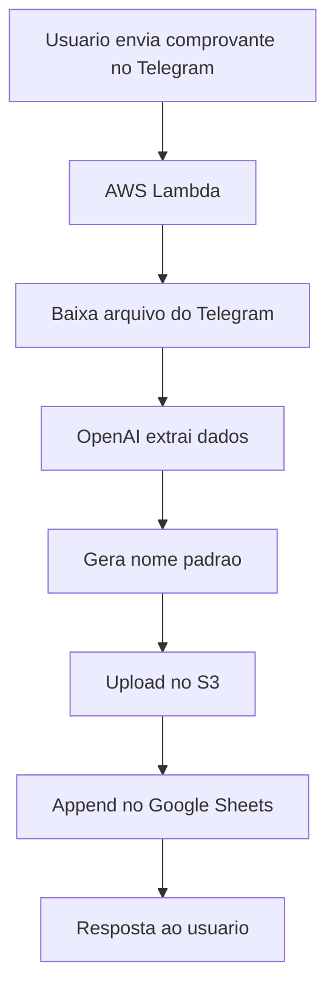

# 🤖 Telegram Comprovantes Bot

Pipeline serverless para receber comprovantes no Telegram, extrair dados com OpenAI, armazenar no S3 e registrar no Google Sheets.

---

## 📌 Sumario

1. Visao Geral
2. Arquitetura
3. Fluxograma
4. Passo a Passo do Fluxo
5. Estrutura de Pastas
6. Tecnologias
7. Contrato de Saida da IA
8. Padronizacao de Nomes
9. Planilha Google Sheets
10. Configuracoes
11. Permissoes Necessarias
12. Implantacao
13. Observabilidade e Erros
14. Roadmap

---

## 🧭 Visao Geral

Objetivo: automatizar o registro de comprovantes enviados pelo Telegram.

Entrada:
- Imagens ou PDF enviados ao bot.

Saidas:
- Arquivo salvo no S3.
- Linha adicionada no Google Sheets.
- Mensagem de retorno ao usuario no Telegram.

---

## 🏗️ Arquitetura

Componentes:
- Telegram Bot
- AWS Lambda
- OpenAI
- Amazon S3
- Google Sheets

Interacao:
- Telegram chama o webhook da Lambda.
- Lambda orquestra todas as etapas.

---

## 🔁 Fluxograma



---

## 🧩 Passo a Passo do Fluxo

1. Usuario envia imagem ou PDF no Telegram.
2. Lambda recebe o webhook com o `file_id`.
3. `telegram_service` monta URL e baixa o arquivo.
4. `openai_service` envia arquivo + descricao ao modelo.
5. Modelo retorna JSON com empresa, valor, data e categoria.
6. `utils.sanitize` padroniza nome do arquivo.
7. `s3_service` grava o arquivo na raiz do bucket.
8. `sheets_service` registra uma linha na planilha.
9. Bot responde o usuario com o resumo.

---

## 📂 Estrutura de Pastas

```
telegram-comprovantes-bot/
├── lambda_function.py
├── services/
│   ├── openai_service.py
│   ├── s3_service.py
│   ├── sheets_service.py
│   └── telegram_service.py
├── utils/
│   └── utils.py
├── config/
│   └── config.py
├── requirements.txt
└── README.md
```

---

## 🛠️ Tecnologias

Stack:
- Python 3.11
- AWS Lambda
- Telegram Bot API
- OpenAI API
- Amazon S3
- Google Sheets API

Dependencias:
- openai
- gspread
- google-auth

---

## 🧾 Contrato de Saida da IA

O modelo deve retornar JSON valido com o seguinte formato:

```json
{
  "empresa": "ODONTOPREV",
  "valor": "10.00",
  "data": "2026-03-09",
  "categoria": "BOLETO"
}
```

Regras:
- Se um campo nao for encontrado, usar `null`.
- Valor deve ser numerico com ponto decimal.
- Categoria deve ser uma das padroes.

Categorias padrao:
- AGUA
- LUZ
- TELEFONE
- INTERNET
- ALUGUEL
- CONDOMINIO
- SAUDE
- EDUCACAO
- MERCADO
- COMBUSTIVEL
- TRANSPORTE
- LAZER
- ASSINATURA
- IMPOSTO
- TAXA
- SEGURO
- BANCO
- OUTROS

---

## 🧼 Padronizacao de Nomes

Formato final do arquivo:
`{EMPRESA}-{CATEGORIA}-{DATA}{extensao}`

Regras aplicadas:
- Remove acentos e cedilha.
- Substitui espacos por `_`.
- Remove caracteres especiais para evitar pastas no S3.

Exemplo:
- Entrada: `Odontoprev S.A - Pagamento 09/03/2026.pdf`
- Saida: `ODONTOPREV_SA-PAGAMENTO-2026-03-09.pdf`

---

## 📊 Planilha Google Sheets

Colunas:
1. Empresa
2. Valor
3. Categoria
4. Data
5. NomeArquivo
6. LinkS3

Exemplo:

| Empresa | Valor | Categoria | Data | NomeArquivo | LinkS3 |
|---|---|---|---|---|---|
| ODONTOPREV | 10,00 | BOLETO | 2026-03-09 | ODONTOPREV-BOLETO-2026-03-09.pdf | https://bucket.s3.amazonaws.com/... |

---

## ⚙️ Configuracoes

Variaveis de ambiente em `config/config.py`:
- TELEGRAM_TOKEN
- OPENAI_API_KEY
- S3_BUCKET
- ID_PLANILHA

Credenciais Google:
- Variavel `GOOGLE_CREDENTIALS` com o JSON da service account.
- Service Account com acesso a planilha.

---

## 🔐 Permissoes Necessarias

AWS:
- `s3:PutObject` no bucket alvo.

Google:
- Compartilhar planilha com o email do service account.

Telegram:
- Webhook configurado para o endpoint da Lambda.

---

## 🚀 Implantacao

1. Configure as variaveis de ambiente na Lambda.
2. Configure a variavel `GOOGLE_CREDENTIALS` com o JSON completo.
3. Instale dependencias e publique a Lambda.
4. Configure o webhook do Telegram.

---

## 🧯 Observabilidade e Erros

Erros comuns:
- JSON invalido da OpenAI.
- Credenciais do Sheets sem acesso.
- Nome do arquivo criando pastas por `/`.

Boas praticas:
- Logar payloads principais.
- Validar retorno da OpenAI.
- Monitorar CloudWatch.

---

## 🧭 Roadmap

1. Validacao adicional de valores monetarios.
2. Normalizacao de datas por padrao regional.
3. Tratamento de duplicatas no S3.
4. Dashboard simples para consultas.

---

## 📎 Referencias

- Telegram Bot API
- OpenAI API
- Amazon S3
- Google Sheets API
- Google Service Accounts
